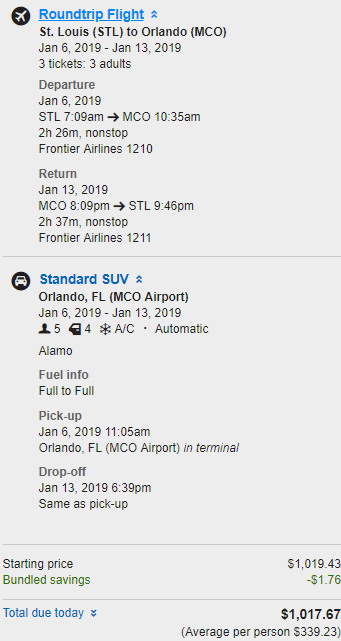

# 7 Days In US-FL
**Travelers:** 40, b7, if  
**Duration:** 2019/01/06-2019/01/13
## Pre-statement
I made a [google map](https://www.google.com/maps/d/viewer?mid=1AzwrIo2SpGukSxl32xe3bUdnjunadmNI&shorturl=1&ll=26.566686853170232%2C-81.52606509999998&z=8) that pin out those locations we plan to go.  
I chooce Expedia Flight+Car which is reasonable cheap and convenient.

  

## Schedule
* **Su. 2019/01/06** 
  * Get up at **5am**. Pick up + drive arriving Lambert around 6am.
  * Check in before **7:10am**. (Include in Expedia deal) 
    
  * Pick up car at terminal. (Include in Expedia deal) 
    
  * Check in
    [Legacy Vacation Resorts-Lake Buena Vista](https://www.booking.com/hotel/us/c-r-lake-buena-vista-lake-buena-vista-florida.zh-cn.html?aid=318615;sid=3c73ed98c4239ad7f81a46868fbc5e5f).
     
  * International Drive. 
    [WonderWorks Orlando](https://www.google.com/maps/reserve/merchant?c=J8g2Un8EFoY&source=pa&hl=en-US&gei=RqQPXPiWN8X4tAXMgqGQBg&sourceurl=https%3A%2F%2Fwww.google.com%2Fsearch%3Fq%3DWonderWorks%2B9067%2Binternational%2BDr%2BOrlando%26oq%3Dwonderworks%26aqs%3Dchrome.4.69i57j69i60l3j69i59j69i60.6552j0j7%26sourceid%3Dchrome%26ie%3DUTF-8#/)`$31.94*3`
  * [Lake Eola Park](http://www.cityoforlando.net/parks/lake-eola-park/)`Free`
* **Mo.&Tu. 2019/01/07&08**
  * [Universal Orlando Resort](https://www.universalorlando.com/web/en/us/index.html)`$214.99*3`
* **We. 2019/01/09**
  * Check out and depart to Miami.
  * Check in Mare
    [Azur Miami Luxury Apartments by Grand Bay](https://www.booking.com/hotel/us/mare-azur-miami-luxury-apartments-by-grand-bay.zh-cn.html?aid=318615;label=New_English_EN_US_MO%253A_Missouri_23681637025-Q29S9vRqx5xlveKRmascZASM92423808745%253Apl%253Ata%253Ap1%253Ap2%253Aac%253Aap1t3%253Aneg;sid=3c73ed98c4239ad7f81a46868fbc5e5f)
    
* **Th. 2019/01/10**
  * **South Beach**
  * [Bayside Marketplace](http://www.baysidemarketplace.com/)`Free`
  * [Vizcaya Museum & Gardens](http://www.vizcaya.org/)`$22*3`
  * [Lincoln Rd](https://www.google.com/maps/place/Lincoln+Rd,+Miami+Beach,+FL+33139/@25.7906669,-80.1387701,17z/data=!3m1!4b1!4m5!3m4!1s0x88d9b485da8f771f:0xae20083995f6acdf!8m2!3d25.7906669!4d-80.1365814)`Free`
  * [Bill Baggs Cape Florida State Park](https://www.floridastateparks.org/parks-and-trails/bill-baggs-cape-florida-state-park)`$5`
  * ~~[World Erotic Art Museum](http://www.weam.com/)~~`Free`
* **Fr. 2019/01/11**
  * **Key West**
  * [Biscayne National Park](https://www.nps.gov/bisc/index.htm)`Free`
  * [Dry Tortugas National Park](https://www.nps.gov/drto/index.htm)`$15`
* **Sa. 2019/01/12**
  * [Everglades National Park](https://www.nps.gov/ever/index.htm)`$25`
  * [Coral Castle](https://coralcastle.com/)`$18*3`
* **Su. 2019/01/13**
  * Driving back to MCO, check in before **8.09pm**. (Include in Expedia deal)
    
  * Drop off, arriving sweet-sweet home around **11pm**.

## Summing Up
Basic consumption(approximate), not including gas, foods, shopping.  
